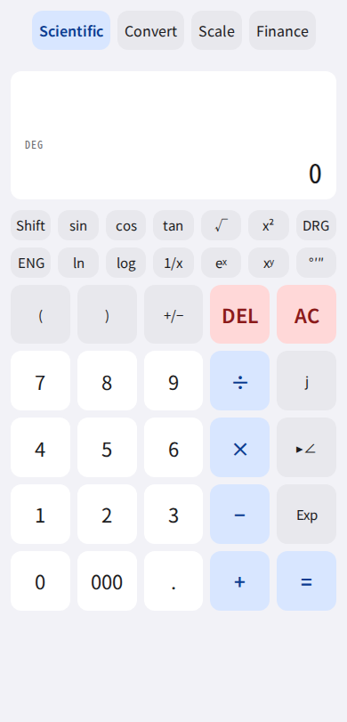
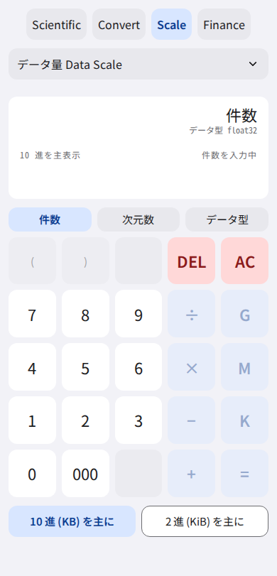
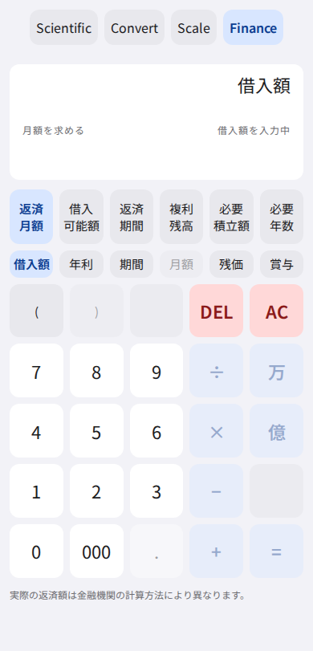

# CalcArc

**[English](README.en.md)**

ブラウザで動く計算ツール群。関数電卓・データ量計算・金融計算。
計算は端末内で完結し、サーバへ送信しない。

## ▶ 使ってみる

**https://calc.terapyon.net/**

インストールは不要。ホーム画面に追加すればアプリとして起動し、オフラインでも動く。

## 現在の版

**0.7.0（ベータ）** — 変更点は [CHANGELOG.md](CHANGELOG.md) に、
リリースごとの記録は [Releases](https://github.com/terapyon/CalcArc/releases) にある。

**ベータである。** 使っている人はまだ少ない。計算結果は無保証で、重要な
判断の根拠にしないでほしい。気づいたことは
[Issue](https://github.com/terapyon/CalcArc/issues) で教えてもらえると助かる。

## 画面

| Scientific | Data Scale | Finance |
|---|---|---|
|  |  |  |

## できること

### Scientific — 関数電卓

四則演算・括弧・符号反転に加えて、

- **複素数と極座標変換。** `3 + j4` を打って `5 ∠ 53.13010235` に変換できる
- `sqrt` `x²` `xʸ` `1/x` `eˣ` `ln` `log` と三角関数・逆三角関数。
  **関数は実数に閉じている**（実数の答が一意に決まらない入力はエラーを返す）
- `n!` `nPr` `nCr`（非負整数の上でのみ定義）
- **60 進の入出力**（`°'"`）。経過時間と角度の両方に使える。度分秒で入れた角度を
  そのまま `sin` に渡せる
- ENG（工学表記）、3 桁カンマ、Degree / Radian

### Data Scale — データ量の計算

要素数 × 次元 × データ型から、必要なメモリ量を 10 進（KB / MB / GB / TB）と
2 進（KiB / MiB / GiB / TiB）の両方で出す。ベクトル検索や機械学習の規模感を
掴むためのもの。

### Finance — 金融計算

- **ローン**（元利均等）— 月額、借入可能額、返済期間の逆算。残価とボーナス併用にも
  対応する（**残価は月額モードでだけ使える。ボーナスは期間モードでは使えない。
  月額モードでは、残価とボーナスのどちらか一方だけ**）
- **複利** — 一括預入と毎月積立。税（源泉分離課税）の有無を選べる
- **複利の逆算** — 目標額から必要な積立額、または必要な年数

**実額の機関一致は目標にしていない。** 返す値は決定的な概算である（画面にも
免責を常設している）。

## 特徴

- **端末内で完結する。** 入力した数値を計算目的で外部へ送らない
- **計算履歴は端末に残る。** Scientific で `=` を押した式・答・角度モードを、
  `localStorage` に 50 件まで保存する。記録を止めるのは履歴の画面から
  （`Shift` → `hist`。既定は記録する。止めても既に貯まった分は残る）。
  消すのも同じ画面から——1 件ずつ、またはまとめて
- **PWA。** ホーム画面に追加でき、オフラインで動く
- **計算コアは Rust、ブラウザでは WebAssembly として動く**
- **Python の独立実装で検証している。** Rust のテストだけに頼らず、SymPy /
  mpmath / `decimal.Decimal` による別実装が生成した期待値と突き合わせる。
  同じアルゴリズムを両方に書くと同じバグが両方に入るので、**実装方法を変えている**

## 免責

**計算結果は無保証です。重要な判断の根拠にしないでください。**

このツールは Apache License 2.0 で提供され、同ライセンスの定めるとおり、
明示・黙示を問わずいかなる保証も伴わない。

## 質問・要望・不具合

**[Issue](https://github.com/terapyon/CalcArc/issues) へどうぞ。** 日本語でも英語でも構わない。

不具合の報告では、**押したキーの順**を書いてもらえると助かる（例: `3 + 4 =`）。
このプロジェクトはキー列と表示の対応表をテストとして持っているので、
**その形で届くとそのまま 1 件のテストになる**。テンプレートが聞くようになっている。

## Numerical Policy

数値の扱いは [docs/numerical-policy.md](docs/numerical-policy.md) に定める。要点は次のとおり。

- **モジュールごとに数値の扱いが違う。** Scientific は浮動小数点、Data Scale は
  厳密整数、Finance は決定的概算である
- **Scientific は**すべての値を複素数として保持する。実数は虚部 0 の複素数である。
  表示は有効数字 10 桁、丸めは round-half-to-even
- **Data Scale は内部を厳密整数（`u128`）で持つ。** 丸めるのは表示のときだけである
- **Finance は決定的な概算を返す。** 実額の機関一致は目標にしていない——返済額の
  端数処理は金融機関ごとに違う。**月額の決定だけが浮動小数点で、償還表は厳密整数**
  である。詳細は [docs/numerical-policy.md](docs/numerical-policy.md) が定める
- **Finance と Data Scale の入力欄に打った式は、途中で丸めない。** 有理数で評価して
  着地で 1 回だけ丸めるので、同じ答えを別の打ち方で入れても結果が変わらない
- **表示のための丸めを、保持している値に書き戻さない。** 極形式への切り替えは
  表示の変更であって計算ではないので、丸めた値が次の計算に入り込まない
- **計算コアは panic しない。** すべてのエラーは `Result` を通り、UI には
  戻り値として届く

## 開発

必要なもの: Rust (stable)、wasm-pack、Node.js + pnpm、uv。

```bash
# 計算コアのテスト
cargo test --workspace

# WASM 境界のテスト
wasm-pack test --headless --chrome crates/calcarc-wasm

# Web（新しいクローンでは先に pnpm wasm が要る）
cd web && pnpm install && pnpm wasm && pnpm dev

# 参照実装と期待値の再生成
cd reference && uv sync && uv run pytest
cd reference && uv run python scripts/generate.py
```

`crates/calcarc-core` の数値を変更したときは期待値の再生成が必要になる。
**再生成せずに `testdata/` を手で書き換えないこと。**

版数を上げるときは **6 箇所**を同じ値にする。`Cargo.toml`、`Cargo.lock`
（`calcarc-core` と `calcarc-wasm` の 2 つ）、`web/package.json`、
`README.md` の「現在の版」、`README.en.md` の「Current version」、
`CHANGELOG.md` の見出し。`pnpm check:version` が 6 箇所すべてを検査する。
**タグを打つときはさらに、版数がタグ名と一致し、CHANGELOG の見出しに
日付が入っていることを CI が確かめる。**

詳しくは [CONTRIBUTING.md](CONTRIBUTING.md) と
[docs/base-spec.md](docs/base-spec.md)（全体仕様）を参照。

## ライセンス

Apache License 2.0。[LICENSE](LICENSE) を参照。
